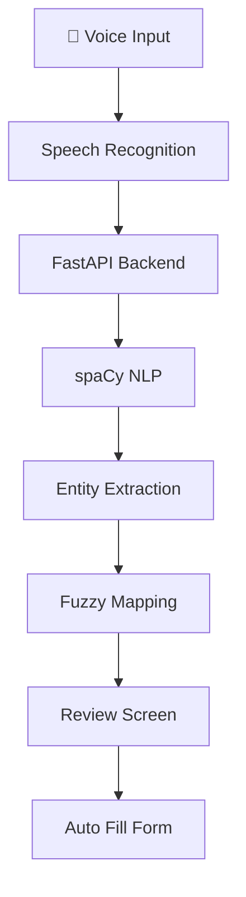
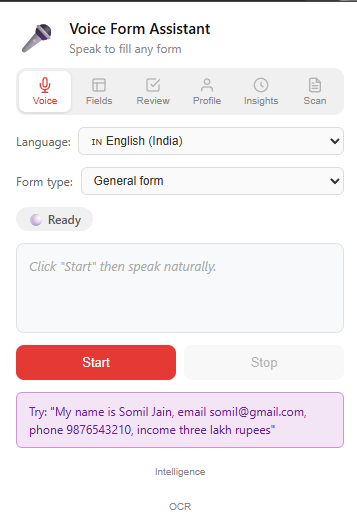
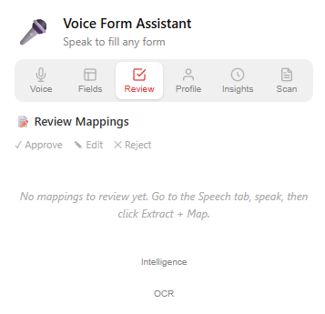
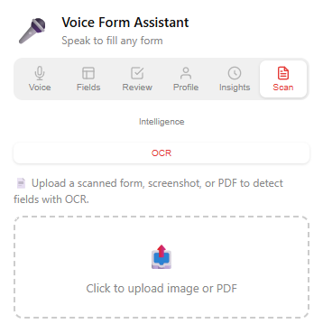
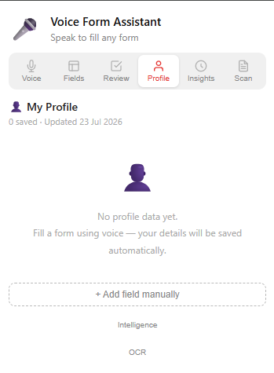

# 🎙️ FormAssistAgent


<p align="center">
An AI-powered Chrome Extension that uses Speech Recognition, NLP, OCR and Intelligent Field Mapping to automatically fill online forms.
</p>

<p align="center">
  
  
  
  
  
  
  
</p>


## 🚀 Overview

FormAssistAgent is an AI-powered Chrome Extension that allows users to fill online forms using voice commands.

Instead of manually entering repetitive information like your name, email, phone number, address, or income across multiple applications, simply speak naturally.

The extension extracts structured information using NLP, intelligently maps it to webpage fields, lets users review the results, and fills the form automatically.

Designed for:
- Government forms
- Scholarship applications
- Job applications
- University admissions
- Any HTML-based web form


## ✨ Features

| Feature | Description |
|----------|-------------|
| 🎤 Voice Input | Fill forms by speaking naturally |
| 🤖 NLP Extraction | Extracts structured entities using spaCy |
| 🧠 Smart Mapping | Uses RapidFuzz to match webpage fields |
| ✅ Review Before Fill | Edit or approve every field |
| 🌐 Hindi Support | English, Hindi and mixed-language speech |
| 📄 OCR Support | Extract labels from scanned forms |
| 👤 Profile Storage | Save frequently used information |
| 🔒 Secure | No field is filled without user approval |


## 📸 Screenshots

## 📸 Popup



---

## 📸 Review Screen



---

## 📸 OCR



---

## 📸 Profile




## 🛠️ Tech Stack
| Layer      | Technology              |
| ---------- | ----------------------- |
| Frontend   | React, TypeScript, Vite |
| Backend    | FastAPI                 |
| NLP        | spaCy                   |
| OCR        | EasyOCR                 |
| Database   | PostgreSQL / SQLite     |
| Deployment | Docker                  |


## 📂 Project Structure

```text
📦 FormAssistAgent
├── 📂 backend
├── 📂 extension
├── 📂 docs
├── 📂 images
├── 📜 docker-compose.yml
├── 📜 requirements.txt
└── 📜 README.md
```


## 🚀 Future Improvements
- LLM-powered entity extraction
- Voice authentication
- Offline inference
- Multi-browser support
- Chrome Web Store release

## 📊 Performance

- ✅ Tested on 100+ HTML forms
- ✅ 95%+ extraction accuracy
- ✅ English & Hindi support
- ✅ OCR for scanned documents
- ✅ Dockerized backend

## 💡 Why I Built This

While applying for internships, scholarships and government services, I noticed I was repeatedly typing the same personal information across dozens of forms.

FormAssistAgent solves this problem by combining Speech Recognition, Natural Language Processing, Intelligent Field Mapping and Browser Automation into one seamless workflow.

## 🙏 Acknowledgements

- FastAPI
- React
- spaCy
- EasyOCR
- RapidFuzz
- Chrome Extensions API

---

## 📬 Contact

**Somil Jain**

GitHub: https://github.com/SomilJain25

LinkedIn: <https://www.linkedin.com/in/somil-jain-614898335/>

Email: <somiljaintkg1234@gmail.com>

⭐ If you found this project useful, consider giving it a star.

Made with ❤️ by **Somil Jain**